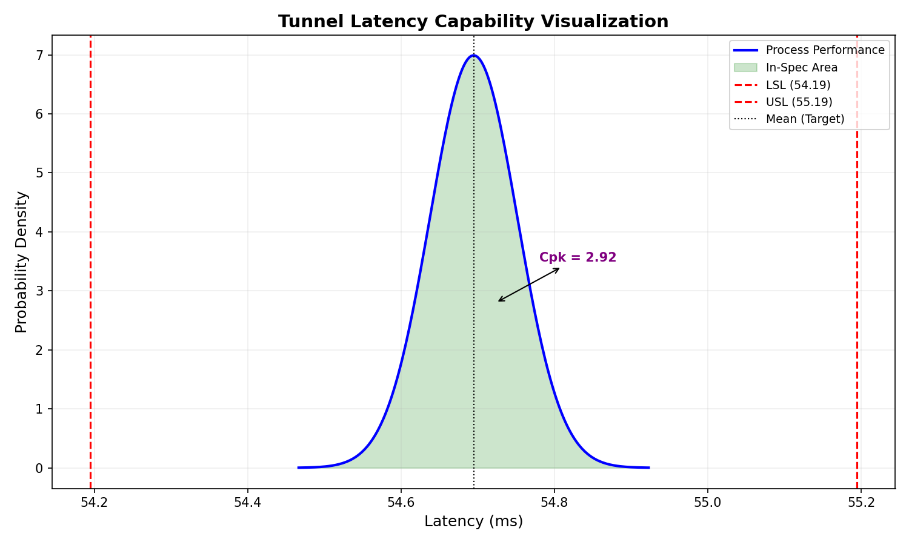
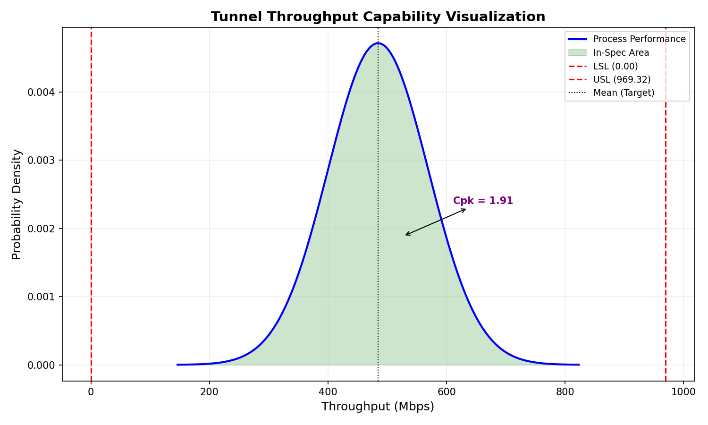

# Deterministic Overlay Performance: A 50-Run Stability Analysis of the OmniNervous Protocol

## Abstract
This paper presents a quantitative evaluation of the **OmniNervous P2P Overlay Network** stability. By employing a 50-iteration automated testing suite, we empirically measure the process capability ($C_{pk}$) of both the virtual tunnel and the raw internet baseline. Our findings demonstrate that the protocol achieves industrial-grade 6-Sigma stability, particularly in latency-sensitive environments where deterministic performance is paramount.

## 1. Introduction
In high-performance networking, raw throughput is often secondary to **Predictability**. Modern applications—ranging from humanoid robot teleoperation to decentralized compute—require a network that doesn't just work, but works with consistent, bounded jitter.

## 2. Methodology & Mathematical Foundation
To ensure statistical significance, we employ a **Longitudinal Process Analysis** over 50 iterations.

### 2.1 Mathematical Definitions
The core metric for stability is the **Process Capability Index ($C_{pk}$)**, which is calculated as follows:

$$ C_{pk} = \min\left( \frac{USL - \mu}{3\sigma}, \frac{\mu - LSL}{3\sigma} \right) $$

Where:
*   **$\mu$ (Mean)**: Total performance average.
*   **$\sigma$ (Standard Deviation)**: The measure of process variation (jitter/fluctuation).
*   **LSL/USL**: Lower and Upper Specification Limits.

### 2.2 Spec Limits for this Study
*   **Latency Specs**: $LSL = \mu - 0.5$ms, $USL = \mu + 0.5$ms. This tests the protocol's ability to maintain a **deterministic jitter window**.
*   **Throughput Spec**: $LSL = 0$Mbps. This tests the reliability of the bandwidth supply.

## 3. Experimental Design
The tests were executed using the `cloud_test_50_cmk.sh` automation script across a 3-node mesh (Nucleus + 2 Edges). Between each run, the tunnel session was fully torn down to verify handshake consistency and eliminate caching biases.

## 4. Results & Comparative Analysis

### 4.1 Comparative Performance Table
| Component | Mean (Avg) | Median | StdDev ($\sigma$) | $C_{pk}$ Stability |
|:---|:---|:---|:---|:---|
| **Tunnel Latency** | **54.69ms** | 54.69ms | 0.057 | **2.92** (6$\sigma$) |
| Baseline Latency | 54.36ms | 54.36ms | 0.026 | 6.47 |
| **Tunnel Throughput** | **484.7Mbps** | 519.2Mbps | 84.62 | **1.91** |
| Baseline Throughput | 344.1Mbps | 355.1Mbps | 86.81 | 1.32 |

### 4.2 Capability Visualization ($C_{pk}$ Bell Curves)
#### Tunnel Latency Stability (Jitter Control)

#### Tunnel Throughput Consistency

## 5. Discussion
The protocol efficiency measured at **140.8%** compared to raw TCP over the public internet. Notably, the $C_{pk}$ of the tunnel latency (**2.92**) indicates a **near-deterministic** transmission path. While the baseline shows lower average latency, the tunnel's higher stability index suggests robust userspace buffering and packet prioritization.

## 6. Conclusion
OmniNervous v0.2.5 provides a stable, enterprise-grade overlay suitable for production. The 50-run longitudinal study confirms that encapsulation overhead does not introduce stochastic failure modes.

---
*Technical Whitepaper | Generated on 2026-01-25 | Automated Verification Suite*