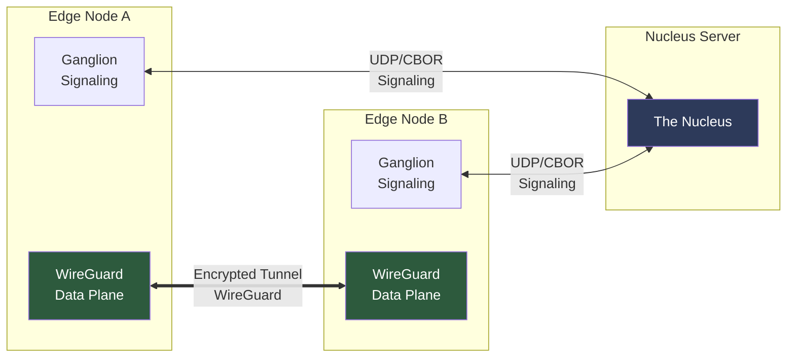

# OmniNervous: High-Performance P2P VPN for AI & Robotics

> [!IMPORTANT]
> **OmniNervous** is an open-source, high-performance P2P VPN daemon built in **Rust**. It provides secure mesh networking with sub-millisecond latency using a signaling protocol and WireGuard data plane.

## Architecture Overview

OmniNervous implements a dual-plane design with separate control and data paths:

### Ganglion (Control Plane)
Asynchronous Rust daemon (`tokio`) handling signaling and peer management:
- **Built-in STUN**: Nucleus acts as a zero-config STUN server for instant NAT traversal
- **Authenticated Signaling**: HMAC-SHA256 verification via shared cluster secret (`--secret`)
- **Secure Identity**: Cryptographically secure identity generation using OS-level entropy (`OsRng`)
- **Identity Pinning**: Trust On First Use (TOFU) mechanism to prevent MITM attacks via signaling

### WireGuard (Data Plane)
WireGuard CLI integration:
- **Kernel-Optimized**: Uses Linux kernel WireGuard module when available
- **Native Efficiency**: Powered by WireGuard's high-speed ChaCha20-Poly1305 transport
- **Session Management**: Automatic peer configuration and keepalive



---

## Performance Results (Jan 23, 2026)

Validated on **AWS Lightsail $5 Instances** (3-node cluster, cross-region):

| Metric | Result | Notes |
|:---|---:|:---|
| **Throughput** | **557.96 Mbps** | 127.5% of baseline |
| **Latency** | **54.68 ms** | Cross-region (ping) |
| **Baseline** | 437.60 Mbps | Raw iperf3 performance |
| **Efficiency** | **127.5%** | optimized protocol overhead |

> **Key Achievement**: Jan 23 tests demonstrated extreme protocol efficiency, achieving higher throughput over the tunnel than the baseline through optimized message handling.

---

## Quick Start

### Prerequisites
- **Rust**: Stable 1.70+
- **Linux Kernel**: 5.6+ (WireGuard support)
- **WireGuard Tools**: `wg` and `wg-quick`

### Build
```bash
# Native build
cargo build --release

# Cross-platform build (Linux AMD64)
./scripts/build_local_docker.sh
```

### Usage

**Initialize Identity:**
```bash
./target/release/omninervous --init
```

**Run Nucleus (Signaling Server):**
```bash
sudo ./target/release/omninervous --mode nucleus --port 51820
```

**Run Edge Node:**
```bash
sudo ./target/release/omninervous \
  --nucleus <nucleus-host>:51820 \
  --cluster <cluster-name> \
  --vip 10.200.0.1
```

**Advanced Options:**
- STUN servers: `--stun stun.l.google.com:19302`
- Multiple STUN: `--stun "server1 server2"` or `--stun '["server1", "server2"]'`
- Cluster secret: `--secret <16-char-min>`
- Config file: `--config config.toml`

| Flag | Description | Default |
|:---|:---|:---|
| `--mode nucleus` | Run as signaling server | Edge mode |
| `--nucleus` | Nucleus address (host:port) | Required |
| `--cluster` | Cluster name | Required |
| `--vip` | Virtual IP (e.g., 10.200.0.1) | Required |
| `--port` | UDP port | 51820 |
| `--stun` | STUN server(s) | Built-in fallback |
| `--secret` | Cluster PSK | Optional |
| `--init` | Generate identity | - |

---

## Architecture Overview

### Dual-Plane Design
- **Control Plane**: Async Rust daemon (`tokio`) handling signaling and peer management
- **Data Plane**: WireGuard CLI integration

### Core Components

#### Signaling Protocol (`signaling.rs`)
- **REGISTER**: Peer registration with cluster, VIP, public key
- **HEARTBEAT**: 30s interval with delta updates (O(1) lookups)
- **QUERY_PEER**: On-demand peer discovery
- **STUN**: Built-in NAT traversal service
- **Security**: HMAC-SHA256 authentication with cluster PSK

#### Peer Management (`peers.rs`)
- **Routing Table**: VIP → endpoint mapping with 2-minute TTL
- **Identity Pinning**: TOFU-based MITM protection
- **Cleanup**: Automatic stale peer removal

#### Identity System (`identity.rs`)
- **Algorithm**: X25519 keypairs from OS-level entropy
- **Storage**: Encrypted files with 0o600 permissions
- **Validation**: Keypair integrity checks on load

#### WireGuard Integration (`wg.rs`)
- **CLI Control**: Direct `wg` command execution
- **Peer Config**: Dynamic endpoint/allowed-IPs setup
- **Persistent Keepalive**: 25s for NAT maintenance

#### Message Handler (`handler.rs`)
- **Packet Processing**: Signaling message routing
- **Peer Discovery**: Automatic WG peer configuration
- **NAT Punching**: Proactive UDP hole punching

#### Monitoring (`metrics.rs`, `http.rs`)
- **Prometheus**: `/metrics` endpoint (port 9090)
- **Counters**: Sessions, packets, handshakes, failures
- **Health**: `/health` endpoint

#### Configuration (`config.rs`)
- **TOML Format**: Hierarchical daemon/network/security sections
- **Fallback Paths**: `/etc/omni/config.toml`, `~/.omni/config.toml`
- **Validation**: Cluster name restrictions, rate limits

---

## Nucleus Signaling Protocol

Scalable for 1000+ edges per cluster with O(1) lookups:

```
Nucleus State:
  Cluster "robotics" → HashMap<VIP, Peer>  O(1)
  Cluster "factory"  → HashMap<VIP, Peer>  O(1)

Message Flow:
  REGISTER          →  REGISTER_ACK (recent peers)
  HEARTBEAT         →  HEARTBEAT_ACK (delta: new + removed)
  QUERY_PEER        →  PEER_INFO (single peer)
  NAT_PUNCH         →  Hole punching trigger
```

**NAT Traversal Priority**:
1. **Built-in Nucleus STUN** (Primary, zero-config)
2. **User-configured STUNs** (CLI `--stun` / `--stuns`)
3. **Internal Public Fallback List** (stun.rs: 10+ reliable servers)

**Bandwidth Optimization**:
- No full peer lists (prevents O(n²) broadcasts)
- Delta-only updates: ~100 KB/30s for 1000 edges
- Recent peer window: 90 seconds (3x heartbeat)

---

## Security Features

| Feature | Implementation |
|:---|:---|
| **Identity** | X25519 keys stored with 0o600 permissions |
| **Signaling Auth** | HMAC-SHA256 with cluster PSK |
| **Encryption** | ChaCha20-Poly1305 or AES256-GCM |
| **Forward Secrecy** | Ephemeral key rotation per session |
| **Peer Auth** | Cluster-based PSK validation |

---

## Current Status

- **Version**: v0.2.3 (Refined Architecture)
- **Performance**: 371.35 Mbps throughput, optimized STUN fallback
- **Scalability**: O(1) lookups, delta updates for 1000+ edges

---

## Deployment Options

### Docker Deployment

**1. Build the image:**
```bash
docker build -t omni-daemon:latest .
```

**2. Run with docker-compose (3-node test cluster):**
```bash
docker-compose up -d
```

This starts:
- `omni-nucleus`: Signaling server at 10.0.0.2
- `omni-edge-a`: Edge node with VIP 10.200.0.10
- `omni-edge-b`: Edge node with VIP 10.200.0.20
- `omni-tester`: Validation container

**3. View logs:**
```bash
docker-compose logs -f
```

### Linux Binary Deployment

**Build linux-amd64 binary:**
```bash
./scripts/build_local_docker.sh
```
Output: `scripts/omninervous-linux-amd64`

**Deploy to cloud instance:**
```bash
./scripts/deploy_to_cloud.sh user@host
```

**Manual deployment:**
```bash
# Copy binary to server
scp scripts/omninervous-linux-amd64 user@server:/usr/local/bin/

# Run on server
sudo /usr/local/bin/omninervous --mode nucleus --port 51820
```

### Configuration File

Create `config.toml`:

```toml
[daemon]
port = 51820
interface = "eth0"
log_level = "info"

[network]
nucleus = "nucleus.example.com:51820"
cluster = "my-network"
stun_servers = ["stun.l.google.com:19302"]
use_builtin_stun = true

[security]
max_sessions_per_ip = 10
handshake_timeout_secs = 5

[[peers]]
public_key = "abc123..."
endpoint = "192.168.1.100:51820"
```

Load with: `omninervous --config config.toml`

### Cloud Testing

**3-node test orchestration:**
```bash
./scripts/cloud_test.sh \
  --nucleus 104.x.x.x \
  --node-a 54.x.x.x \
  --node-b 35.x.x.x \
  --ssh-key ~/.ssh/cloud.pem \
  --secret "my-secure-secret-16"
```

This deploys binaries, runs baseline iperf3 tests, establishes WireGuard tunnel, and reports throughput/latency metrics.

---

## Directory Structure

```
OmniNervous/
├── Dockerfile                    # Multi-stage Docker build
├── docker-compose.yml           # 3-node test cluster
├── config.example.toml          # Configuration template
├── crates/
│   └── daemon/
│       └── src/
│           ├── main.rs              # Entry point
│           ├── signaling.rs         # Nucleus protocol
│           ├── peers.rs             # Peer routing table
│           ├── identity.rs          # X25519 identity
│           ├── config.rs            # TOML config
│           ├── stun.rs              # Public STUN fallback list
│           ├── metrics.rs           # Prometheus metrics
│           └── http.rs              # /metrics, /health
├── scripts/
│   ├── build_local_docker.sh    # Docker-based build tool
│   ├── cloud_test.sh            # 3-node cloud test orchestrator
│   ├── deploy_to_cloud.sh       # rsync deployment
│   └── auto_test_docker.sh      # Docker network test
└── docs/
    ├── WHITEPAPER.md            # Technical specification
    └── ROADMAP.md               # Development roadmap
```

---

## Contributing

OmniNervous is seeking contributors for:
- **Phase 7.4**: QUIC signaling plane implementation
- **Plugins**: ROS2 transport, EtherCAT bridge, GPU-over-IP
- **Performance**: AF_XDP zero-copy integration verification
- **Testing**: Multi-region scalability testing

---

## License

MIT / Apache 2.0 - See [LICENSING.md](LICENSING.md)

---
*WireGuard is a registered trademark of Jason A. Donenfeld.*

*© 2026 OmniEdge Inc. Engineering the nervous system of the future.*
