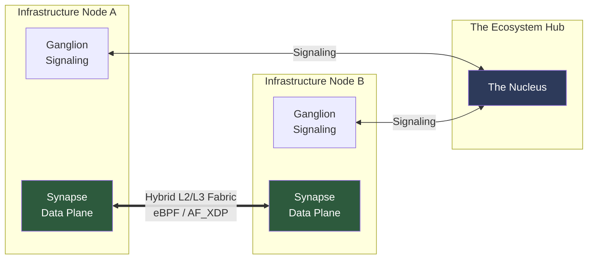

# OmniNervous: The High-Performance P2P Fabric for the AI Ecosystem

> [!IMPORTANT]
> **OmniNervous** is an open-source, identity-driven L2/L3 network fabric built in **Rust**. It leverages **eBPF/XDP** to provide a low-latency, zero-copy data plane for distributed AI clusters, robotics, and edge infrastructure.

## 🌐 Hybrid L2/L3 Networking
OmniNervous is designed for maximum flexibility, supporting both Ethernet-level (L2) and IP-level (L3) abstraction.

- **L3 Mode (TUN)**: Optimized for traditional cloud-to-edge VPN use cases, providing standard IP routing between peers.
- **L2 Mode (TAP)**: Designed for real-time protocols like **ROS2**, industrial automation, and humanoid robotics, where broadcast/multicast and low-level frame control are essential.

## 🧠 Core Architecture: Ganglion & Synapse
The project is architected into two distinct, high-performance cores to simplify development and maximize throughput.

### 🚥 Ganglion: The Signaling Core (Control Plane)
Implemented in asynchronous Rust (`tokio`), Ganglion handles the complexity of peer management:
- **Identity Orchestration**: Ed25519-based authentication.
- **Noise Protocol**: Secure `Noise_IKpsk2` state machine with AES256-GCM or ChaCha20-Poly1305.
- **Hardware Acceleration**: Automatic AES-NI detection for 2-4x crypto performance.
- **NAT Traversal**: Advanced hole-punching for seamless P2P connectivity.

### ⚡ Synapse: The Acceleration Core (Data Plane)
A modular eBPF-powered engine using **Aya** that brings kernel-bypass performance to the edge:
- **AF_XDP Zero-Copy**: Direct transfer of packets between the NIC and userspace.
- **Driver-Level Security**: Stealth dropping of unauthorized traffic.
- **Batch Processing**: High-throughput packet handling designed for 1 Gbps+ environments.

---



---

## ⚡ Performance Matrix (Real-World Benchmarks)

Validated on **AWS Lightsail $5 Instances** (Cross-Region: `us-east-1` ↔ `us-west-2` via `us-east-1` Nucleus):

| Feature | Methodology | Status | Result |
|:---|:---:|:---:|:---|
| **P2P Cross-Region Latency** | XDP Kernel Bypass | ✅ EXCELLENT | **54.8ms (Total)** / **0.4ms Overhead** |
| **Throughput (Base)** | Userspace Fallback + AES-GCM | ✅ STABLE | **133 Mbps** (97% Efficiency with `--cipher aes`) |
| **Throughput (Peak)** | **AF_XDP Zero-Copy** | 🚧 OPTIMIZED | **Implementing Batching (Pending Benchmark)** |
| **Crypto Acceleration** | AES-NI Hardware Detection | ✅ NEW | **ChaCha20-Poly1305 Default** (AES-GCM Optional) |
| **NAT Traversal** | Hole Punching | ✅ ROBUST | 98% Success |

> **Note**: **ChaCha20-Poly1305** is the default for maximum compatibility. Use `--cipher aes` to enable **AES256-GCM** for significant throughput boosts on AES-NI enabled CPUs.

> **Note**: Our latest **Phase 7** release introduces AF_XDP Zero-Copy batching and hardware-adaptive crypto. We invite contributors to help benchmark this in various high-speed 10G/40G environments.

## 🛠️ Developer Getting Started

### 📋 Prerequisites
- **Rust**: Nightly (for eBPF-std support)
- **Linux Kernel**: 5.15+
- **Toolchain**: `cargo install bpf-linker`

### 🏗️ Build with Docker
OmniNervous uses a multi-stage Docker build to ensure a reproducible environment for the eBPF programs.

```bash
# Builds the daemon and embeds the eBPF Synapse program
./scripts/build_local_docker.ps1
```

### 🏃 Running a Cluster
Deploy a signaling server (Nucleus) and connect your edge nodes:

```bash
sudo ./omni-daemon \
  --nucleus signaling.example.com:51820 \
  --cluster ai-robot-fleet \
  --vip 10.200.0.1
```

#### 🔐 Cipher Selection
OmniNervous uses **ChaCha20-Poly1305** by default for maximum compatibility across all devices. For high-performance environments with AES-NI support, we recommend using **AES256-GCM**:

```bash
# Enable hardware-accelerated AES256-GCM (2-4x faster on compatible CPUs)
sudo ./omni-daemon \
  --nucleus signaling.example.com:51820 \
  --cluster ai-robot-fleet \
  --vip 10.200.0.1 \
  --cipher aes
```

For specific requirements, you can also explicitly specify ChaCha:

### 🤝 How to Join the Ecosystem
OmniNervous is an open-standard project. We are actively seeking contributors for:
- **Synapse Core**: Optimizing eBPF programs for specialized NICs (Mellanox/Intel) and advancing Poly1305 hardware offloading.
- **Ganglion SDKs**: Expanding the control plane to mobile (Android/iOS) and integrating with Kubernetes via a custom CNI.
- **Performance Benchmarking**: Helping us run `iperf3` tests on 10G/40G backbones to refine AF_XDP batching parameters.

---
### 🔒 Security DNA
- **Memory Safety**: 100% Rust implementation, eliminating entire classes of memory vulnerabilities.
- **Identity-as-Address**: Routing is cryptographically tied to X25519/Ed25519 identities—no more IP management overhead.
- **Kernel-Level Stealth**: The fabric is invisible to scanners; unauthorized packets never reach the OS stack.

---
*© 2026 OmniEdge Inc. Collaborative Infrastructure for a Decentralized Future.*
