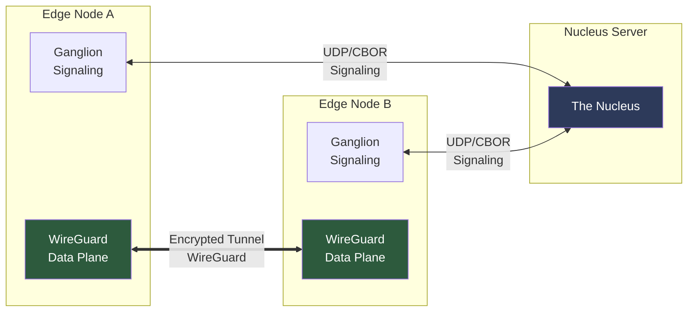

# OmniNervous: High-Performance P2P VPN for AI & Robotics

> [!IMPORTANT]
> **OmniNervous** is an open-source, high-performance P2P VPN daemon built in **Rust**. It combines the Noise IK protocol with native WireGuard integration for secure mesh networking with sub-millisecond latency.

## Architecture Overview

OmniNervous implements a dual-plane design with separate control and data paths:

### Ganglion (Control Plane)
Asynchronous Rust daemon (`tokio`) handling signaling and peer management:
- **Nucleus Protocol**: Decentralized peer discovery via REGISTER/HEARTBEAT/QUERY messages
- **Cluster Authentication**: PSK-based authentication with X25519 identity verification
- **NAT Traversal**: STUN-based endpoint discovery for seamless connectivity

### WireGuard (Data Plane)
Native WireGuard integration via `defguard_wireguard_rs`:
- **Kernel-Optimized**: Uses Linux kernel WireGuard module when available
- **Dual Cipher Support**: ChaCha20-Poly1305 and AES256-GCM with hardware acceleration
- **Session Management**: Automatic peer configuration and keepalive



---

## Performance Results (v0.2.2)

Validated on **AWS Lightsail $5 Instances** (3-node cluster, cross-region):

| Metric | Result | Notes |
|:---|---:|:---|
| **Throughput** | **133.24 Mbps** | 97.2% of baseline |
| **Latency Overhead** | **0.4 ms** | VPN tunnel overhead |
| **Baseline** | 137.02 Mbps | Raw iperf3 performance |
| **Cipher** | AES256-GCM | ChaCha20 also supported |

> **Key Achievement**: Phase 7.2 achieved 97.2% baseline efficiency through hardware-accelerated AES-GCM and optimized logging.

---

## Quick Start

### Prerequisites
- **Rust**: Stable 1.70+
- **Linux Kernel**: 5.6+ (for WireGuard support)
- **WireGuard Tools**: `wg` and `wg-quick` installed

### Build
```bash
cargo build --release
```

### Running OmniNervous

**1. Start Nucleus (signaling server):**
```bash
sudo ./target/release/omni-daemon --mode nucleus --port 51820
```

**2. Connect edge nodes:**
```bash
sudo ./target/release/omni-daemon \
  --nucleus nucleus.example.com:51820 \
  --cluster my-network \
  --vip 10.200.0.1
```

**3. With PSK authentication:**
```bash
sudo ./target/release/omni-daemon \
  --nucleus nucleus.example.com:51820 \
  --cluster my-network \
  --secret "your-secure-secret-here" \
  --vip 10.200.0.1 \
  --cipher aesgcm
```

### CLI Options
| Flag | Description | Default |
|:---|:---|:---|
| `--mode nucleus` | Run as signaling server | Edge mode |
| `--nucleus` | Nucleus server address | Required for edge |
| `--cluster` | Cluster name to join | Required |
| `--secret` | Cluster PSK (min 16 chars) | Optional |
| `--vip` | Virtual IP address (e.g., 10.200.0.1) | Required for edge |
| `--port` | UDP port | 51820 |
| `--cipher` | Encryption: `chachapoly` or `aesgcm` | chachapoly |
| `--init` | Generate new identity and exit | - |

---

## Core Components

### `omni-daemon/src/main.rs`
Entry point handling CLI parsing, mode selection (nucleus/edge), WireGuard interface creation, and the main event loop.

### `signaling.rs`
Nucleus protocol implementation:
- `REGISTER` / `REGISTER_ACK`: Peer registration with recent peer list
- `HEARTBEAT` / `HEARTBEAT_ACK`: Keepalive with delta updates
- `QUERY_PEER` / `PEER_INFO`: On-demand peer lookup (O(1))

### `peers.rs`
Peer routing table (VIP → endpoint mapping) with timeout-based cleanup.

### `identity.rs`
X25519 key generation, storage, and validation with 0o600 permissions.

### `config.rs`
TOML-based configuration with fallback paths (`/etc/omni/config.toml`, `~/.omni/config.toml`).

### `metrics.rs` / `http.rs`
Prometheus-compatible metrics server on port 9090 (`/metrics`, `/health` endpoints).

---

## Nucleus Signaling Protocol

Scalable for 1000+ edges per cluster with O(1) lookups:

```
Nucleus State:
  Cluster "robotics" → HashMap<VIP, Peer>  O(1)
  Cluster "factory"  → HashMap<VIP, Peer>  O(1)

Message Flow:
  REGISTER          →  REGISTER_ACK (recent peers)
  HEARTBEAT         →  HEARTBEAT_ACK (delta: new + removed)
  QUERY_PEER        →  PEER_INFO (single peer)
```

**Bandwidth Optimization**:
- No full peer lists (prevents O(n²) broadcasts)
- Delta-only updates: ~100 KB/30s for 1000 edges
- Recent peer window: 90 seconds (3x heartbeat)

---

## Security Features

| Feature | Implementation |
|:---|:---|
| **Identity** | X25519 keys stored with 0o600 permissions |
| **Handshake** | Noise IK with PSK authentication |
| **Encryption** | ChaCha20-Poly1305 or AES256-GCM |
| **Forward Secrecy** | Ephemeral key rotation per session |
| **Peer Auth** | Cluster-based PSK validation |

---

## Current Status

- **Version**: v0.2.2 (Phase 7.2 complete)
- **Development Phase**: Production-ready for small clusters (10-100 edges)
- **Active Development**: Phase 7.4 (QUIC signaling) in progress
- **Performance**: 97.2% baseline efficiency, sub-1ms latency
- **Scalability**: O(1) lookups, delta updates for 1000+ edges

---

## Deployment Options

### Docker Deployment

**1. Build the image:**
```bash
docker build -t omni-daemon:latest .
```

**2. Run with docker-compose (3-node test cluster):**
```bash
docker-compose up -d
```

This starts:
- `omni-nucleus`: Signaling server at 10.0.0.2
- `omni-edge-a`: Edge node with VIP 10.200.0.10
- `omni-edge-b`: Edge node with VIP 10.200.0.20
- `omni-tester`: Validation container

**3. View logs:**
```bash
docker-compose logs -f
```

### Linux Binary Deployment

**Build for linux-amd64:**
```bash
./scripts/build_linux_amd64.sh
```

This produces `scripts/omni-daemon-linux-amd64` for cloud deployment.

**Deploy to cloud:**
```bash
./scripts/deploy_to_cloud.sh user@host
```

### Configuration File

Create `config.toml`:

```toml
[daemon]
port = 51820
interface = "eth0"
log_level = "info"

[network]
nucleus = "nucleus.example.com:51820"
cluster = "my-network"

[security]
max_sessions_per_ip = 10
handshake_timeout_secs = 5

[[peers]]
public_key = "abc123..."
endpoint = "192.168.1.100:51820"
```

Load with: `omni-daemon --config config.toml`

### Cloud Testing

**3-node test orchestration:**
```bash
./scripts/cloud_test.sh \
  --nucleus 104.x.x.x \
  --node-a 54.x.x.x \
  --node-b 35.x.x.x \
  --ssh-key ~/.ssh/cloud.pem \
  --secret "my-secure-secret-16"
```

This deploys binaries, runs baseline iperf3 tests, establishes WireGuard tunnel, and reports throughput/latency metrics.

---

## Directory Structure

```
OmniNervous/
├── Dockerfile                    # Multi-stage Docker build
├── docker-compose.yml           # 3-node test cluster
├── config.example.toml          # Configuration template
├── omni-daemon/
│   └── src/
│       ├── main.rs              # Entry point
│       ├── signaling.rs         # Nucleus protocol
│       ├── peers.rs             # Peer routing table
│       ├── identity.rs          # X25519 identity
│       ├── config.rs            # TOML config
│       ├── metrics.rs           # Prometheus metrics
│       └── http.rs              # /metrics, /health
├── scripts/
│   ├── build_linux_amd64.sh     # Cross-compile for amd64
│   ├── build_local_docker.sh    # Docker build script
│   ├── cloud_test.sh            # 3-node cloud test
│   ├── deploy_to_cloud.sh       # rsync deployment
│   └── auto_test_docker.sh      # Docker network test
└── docs/
    ├── WHITEPAPER.md            # Technical specification
    └── ROADMAP.md               # Development roadmap
```

---

## Contributing

OmniNervous is seeking contributors for:
- **Phase 7.4**: QUIC signaling plane implementation
- **Plugins**: ROS2 transport, EtherCAT bridge, GPU-over-IP
- **Performance**: AF_XDP zero-copy integration verification
- **Testing**: Multi-region scalability testing

---

## License

MIT / Apache 2.0 - See LICENSING.md

---
*© 2026 OmniEdge Inc. Engineering the nervous system of the future.*
