# OmniNervous: The 2026 AI Fabric L2 Protocol

> [!IMPORTANT]
> **OmniNervous** is a next-generation, identity-driven Layer 2 fabric implemented entirely in **Rust**. It is designed for AI clusters and real-time humanoid robotics where low latency and cryptographic certainty are non-negotiable.

## 🧠 Architecture Overview

OmniNervous dissolves the "Network Tax" by splitting the protocol into two specialized layers:

- **Ganglion (Control Plane)**: An asynchronous Rust daemon (`tokio`) that handles high-level "Intellectual" tasks—Identity management, Noise handshakes, and NAT traversal.
- **Synapse (Data Plane)**: A zero-copy XDP engine (`aya`) that intercepts and process packets at the driver level, providing **Cryptographic Silence** (stealth mode).

```mermaid
graph TB
    subgraph Peer_A["🤖 Robot A"]
        GA[Ganglion<br/>Control Plane]
        SA[Synapse<br/>XDP Engine]
    end
    
    subgraph Nucleus["☁️ Nucleus"]
        NR[Rendezvous<br/>Server]
    end
    
    subgraph Peer_B["🤖 Robot B"]
        GB[Ganglion<br/>Control Plane]
        SB[Synapse<br/>XDP Engine]
    end
    
    GA -.->|1. Register| NR
    GB -.->|1. Register| NR
    NR -.->|2. Exchange Endpoints| GA
    NR -.->|2. Exchange Endpoints| GB
    SA <-->|3. Direct P2P<br/>Encrypted L2| SB
    
    style SA fill:#2d5a3d
    style SB fill:#2d5a3d
    style NR fill:#4a4a6a

```



## 🚀 Getting Started

### Prerequisites

| Component | Requirement |
| :--- | :--- |
| **Rust** | Stable 1.79.0+ |
| **Linux Kernel** | 5.15+ (with BPF/XDP support) |
| **BPF Linker** | `cargo install bpf-linker` |

### 🛠️ Building

#### 1. The Ganglion Daemon
The userspace daemon can be built natively or via Docker.

**Local Native Build:**
```bash
cargo build -p omni-daemon --release
```

**Local Docker Build (Recommended for Linux):**
```bash
./scripts/build_local_docker.sh
```

#### 2. Cross-Compilation (macOS → Linux amd64)
If you are developing on Apple Silicon (M1/M2/M3), choose your speed:

**A. High-Speed (Recommended):**
Uses native cross-compilation (no emulation). Requires `brew install zig`.
```bash
./scripts/build_cross_fast.sh
```

**B. Docker-based (Slow):**
Uses QEMU emulation. Note: This can take 30+ minutes due to project complexity (`aya`, `tokio`).
```bash
./scripts/build_linux_amd64.sh
```

#### 3. The Synapse Engine (Linux Only)
To compile the eBPF kernel program:
```bash
# Build eBPF program
cargo +nightly build -p omni-ebpf-core --target bpfel-unknown-none -Z build-std=core --release
```
The resulting binary will be found in `target/bpfel-unknown-none/release/omni-ebpf-core`.

### ⚡ eBPF/XDP Acceleration

OmniNervous uses eBPF/XDP for **line-rate packet processing** on Linux:

| Feature | Userspace Mode | XDP Mode |
|:---|:---|:---|
| **Latency** | ~100μs | <10μs |
| **Throughput** | ~10 Gbps | 100+ Gbps* |
| **CPU Usage** | Higher | Minimal (kernel bypass) |
| **Platform** | All platforms | Linux 5.4+ only |

*\* Theoretical maximum with high-end NICs*

#### Requirements for XDP Mode
- Linux kernel 5.4 or later
- Network interface with XDP driver support
- Root privileges (for eBPF loading)

#### Usage

```bash
# Default: Auto-detect and enable XDP if available
sudo ./omni-daemon --iface eth0 --port 51820

# Disable XDP (force userspace mode)
./omni-daemon --iface eth0 --port 51820 --no-ebpf
```

#### XDP Verification
```bash
# Check if XDP is loaded
sudo bpftool prog show | grep xdp_synapse

# View BPF maps
sudo bpftool map show | grep SESSIONS
```

#### Current XDP Implementation Status

| Component | Status |
|:---|:---|
| ChaCha20 Decryption | ✅ Implemented |
| Poly1305 MAC Verification | ✅ Implemented |
| Session Map Lookup | ✅ Implemented |
| FDB Forwarding | ✅ Implemented |
| Auto-Enable Detection | ✅ Implemented |

> **Note**: The XDP program is currently compiled separately and not yet embedded in omni-daemon.
> Future releases will include a single binary with embedded eBPF.

### 🧪 Testing & Deployment

#### 🖥️ Platform Support

- **Linux (High-Performance)**:
  Uses the **Synapse XDP Engine** for zero-copy data paths. Direct frame injection bypasses the kernel network stack.
  ```bash
  sudo ./target/release/omni-daemon --iface eth0
  ```
- **macOS (Development/Fallback)**:
  Operates in **Userspace Mode** via a Virtual TUN/TAP interface. Suitable for control-plane verification and remote management.
  ```bash
  ./target/release/omni-daemon --iface utun0
  ```

#### 🌐 Remote Testing (Peer-to-Peer)

To establish a link between two remote devices (e.g., Robot A and Cloud Node B):

1.  **Identity Exchange**: Both peers generate an Ed25519 keypair.
2.  **Configuration**:
    - **Peer A**: `./omni-daemon --peer <PUBKEY_B> --endpoint <IP_B>:51820`
    - **Peer B**: `./omni-daemon --peer <PUBKEY_A> --endpoint <IP_A>:51820`
3.  **Verification**: Once the Noise handshake completes, Ping the virtual L2 addresses.

#### 📡 The Nucleus (Signaling Server)

OmniNervous uses a **Nucleus** to facilitate connectivity behind NAT/Firewalls:
- Unlike an L3 VPN, the Nucleus only handles **Signaling** (discovery and hole-punching).
- Data traffic is strictly **P2P** via the Synapse engine.
- Designed to scale to **1000+ edges per cluster** with on-demand peer discovery.

**Signaling Protocol:**

| Message | Direction | Purpose |
|:---|:---:|:---|
| `REGISTER` → `REGISTER_ACK` | Edge ↔ Nucleus | Join cluster, receive recent peers (last 90s) |
| `HEARTBEAT` → `HEARTBEAT_ACK` | Edge ↔ Nucleus | Keep-alive, receive delta (new/left peers) |
| `QUERY_PEER` → `PEER_INFO` | Edge ↔ Nucleus | On-demand O(1) VIP lookup |


**Scalability:**
- Full peer list is **never sent** (prevents O(n²) explosion)
- Delta updates only include changes since last heartbeat
- On-demand `QUERY_PEER` for unknown VIPs

#### 🧪 Local Cluster Simulation (Docker)

To verify the "Neural Path" of a full cluster on your local machine:
```bash
./scripts/run_local_autotest.sh
```
This single command handles the entire lifecycle:
1.  **Cleanup**: Removes any legacy containers/networks.
2.  **Startup**: Spawns a `Nucleus` and two `Edge` nodes.
3.  **Verification**: Runs the `tester` suite (Handshake + iperf3).
4.  **Teardown**: Gracefully stops and cleans up the test environment.

##### ✅ Latest Test Results (2026-01-13)

> **Note**: These results are from Docker containers on localhost.
> Real-world WAN performance will differ based on network conditions.

| Test | Status |
|:---|:---|
| **Nucleus Rendezvous** | ✅ ONLINE |
| **Edge A Registration** | ✅ Registered |
| **Edge B Registration** | ✅ Registered |
| **NAT Traversal** | ✅ UDP Hole Punch SUCCESS |
| **Direct P2P Channel** | ✅ ESTABLISHED |
| **Noise_IK Handshake** | ✅ COMPLETED |
| **FDB Learning** | ✅ 2 entries learned |
| **iperf3 (localhost)** | ✅ Functional* |

*\* Localhost benchmarks validate functionality, not production throughput.*

#### ☁️ Hybrid Cloud & Full Cluster Deployment

To test connectivity across real cloud instances:

1.  **Sync Codebase to Cloud**: Use `rsync` with smart excludes to quickly deploy the source to a VPS.
    ```bash
    ./scripts/deploy_to_cloud.sh root@<REMOTE_IP>
    ```

2.  **Automated 3-Node Cloud Test**: Orchestrate a full test (Nucleus + 2 Edges) across three cloud instances.
    ```bash
    ./scripts/cloud_test.sh \
      --nucleus <NUCLEUS_IP> \
      --node-a <EDGE_A_IP> \
      --node-b <EDGE_B_IP> \
      --secret "your-secure-secret-16-chars"
    ```
    This script handles:
    - Process cleanup and log management (in `/tmp/`)
    - Daemon startup with background detachment
    - Baseline performance measurement (Public IP ping/iperf3)
    - VPN tunnel verification (Handshake + iperf3)

3.  **Manual Nucleus Setup**:
    ```bash
    ./scripts/deploy_nucleus.sh <user@remote-ip>
    ```
### 🪜 Peer Usage Flow

Using OmniNervous is designed to be as simple as plugging in a physical cable:

1.  **Initialization**: Run the daemon to generate your identity.
    ```bash
    omni-daemon --init
    # Your Public Identity: 8yYx...9a2z
    ```
2.  **Joining a Cluster**: Point your daemon to the Nucleus or a known peer.
    ```bash
    omni-daemon --nucleus nucleus.omni.io --cluster ai-robot-fleet
    ```
3.  **Discovery**: OmniNervous automatically performs the Noise handshake with authorized peers in the cluster.
4.  **Network Interaction**: A new virtual interface `omni0` appears.
    - Your applications (ROS2, etc.) use `omni0`.
    - Routing is handled by the **Synapse Engine** based on the peer's public key.

## ⚙️ Configuration

### Command Line

Run with `--help` for all options:

```bash
omni-daemon --help
```

**Nucleus (Signaling Server):**
```bash
omni-daemon --mode nucleus --port 51820
```

**Edge Client (P2P VPN):**
```bash
omni-daemon \
  --nucleus 1.2.3.4:51820 \
  --cluster mynetwork \
  --secret "YourSecretAtLeast16Chars" \
  --vip 10.200.0.1
```

### Configuration File (Planned)

TOML configuration file support is defined but not yet active. See [config.example.toml](config.example.toml) for the planned format:

```toml
[daemon]
port = 51820

[network]
nucleus = "nucleus.example.com"
cluster = "ai-robot-fleet"

[security]
max_sessions_per_ip = 10
```

## 📊 Observability

Built-in Prometheus metrics (accessible via API):
- `omni_sessions_active` — Current active sessions
- `omni_packets_rx_total` — Total packets received
- `omni_handshakes_completed_total` — Successful handshakes
- `omni_sessions_dropped_ratelimit_total` — Rate-limited connections

## 🛡️ Rate Limiting

DoS protection is enabled by default:
- **10 new sessions per IP per second**
- **5 second handshake timeout**
- **1 hour session expiration**

## 🔒 Security DNA

- **Identity-as-Address**: Routing is derived from Ed25519 Public Keys.
- **Stealth Mode**: Unauthorized packets are dropped at the XDP level, leaving no trace in OS logs or `dmesg`.
- **Memory Safety**: 100% Rust implementation provides a mathematical guarantee against buffer overflows and use-after-free vulnerabilities.

---
*© 2026 OmniEdge Inc. Engineering the Nervous System of the Future.*
